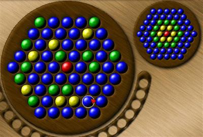



## DirectX Rotation Game \(Part 1 of 2\)

### Description

NOTE: You need to download DirectX Rotation Game (Part 2 of 2) CodeID is 51889. Remember to put all the graphic files in the folder < Graphics > under app dir.

This is the game, as far as I know, originally created by Diapraxas team. You can visit their website at http://www.diapraxas.net/rotation for more information. I downloaded their game, played it, and thought I'd try to create this game. It took me a week to implement the game. So comments and suggestions would be greatly appreciated. For any reason, if the background display is very bad, e-mail me. I've only included Background.jpg because *.bmp version is 3.00 MB and I couldn't upload it. See the screenshot for what the game looks like. Also remember to download Rotation Game Level Editor to create custom levels (CodeID is 51890).
 
### More Info
 

             |
---                |---
**Submitted On**   |2004-02-20 00:33:20
**By**             |[Min Thant Sin](https://github.com/Planet-Source-Code/PSCIndex/blob/master/ByAuthor/min-thant-sin.md)
**Level**          |Intermediate
**User Rating**    |4.7 (14 globes from 3 users)
**Compatibility**  |VB 6\.0
**Category**       |[Games](https://github.com/Planet-Source-Code/PSCIndex/blob/master/ByCategory/games__1-38.md)
**World**          |[Visual Basic](https://github.com/Planet-Source-Code/PSCIndex/blob/master/ByWorld/visual-basic.md)
**Archive File**   |[DirectX\_Ro1711102202004\.zip](https://github.com/Planet-Source-Code/min-thant-sin-directx-rotation-game-part-1-of-2__1-51888/archive/master.zip)

